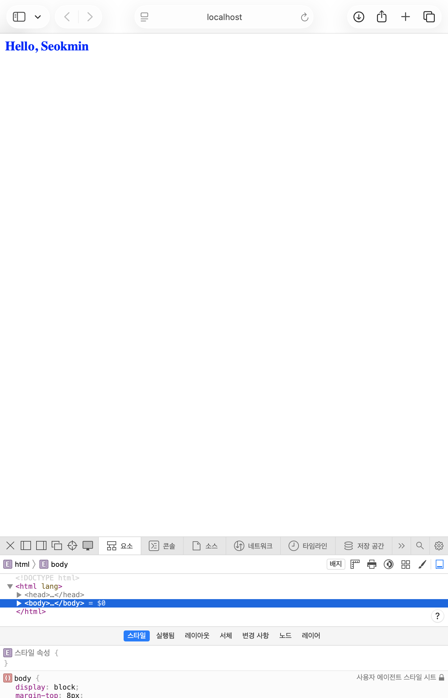
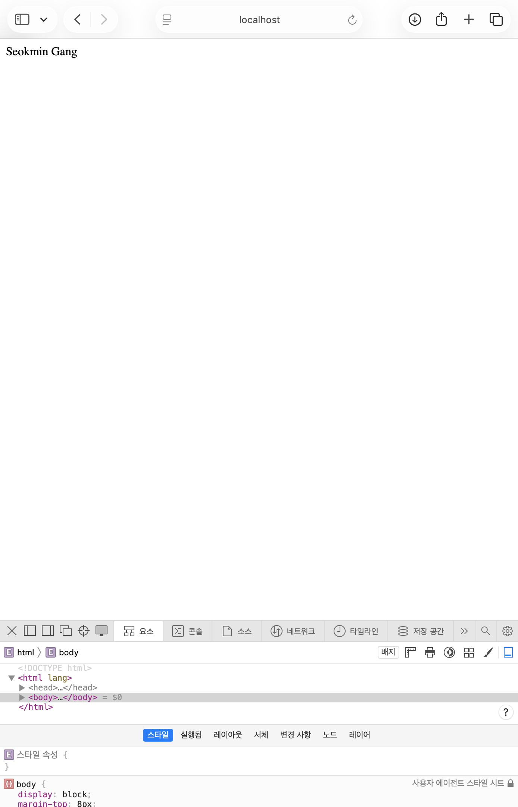
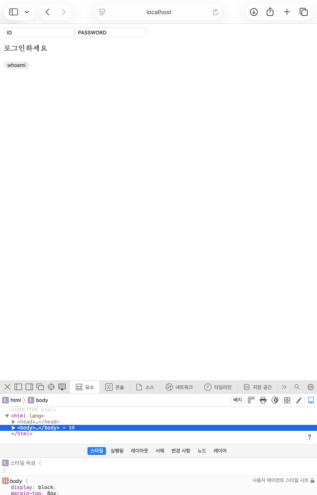
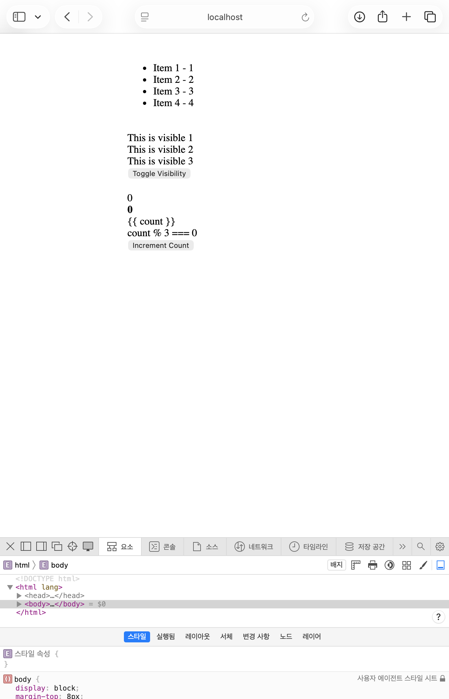
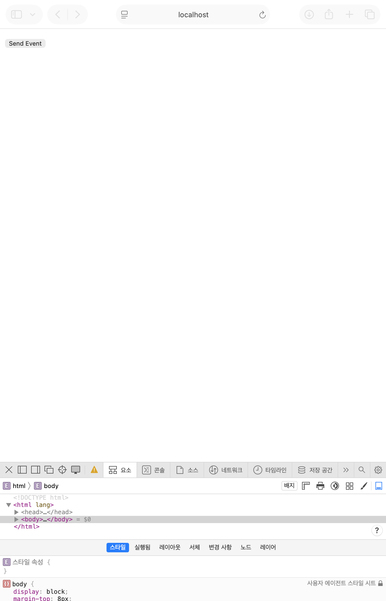
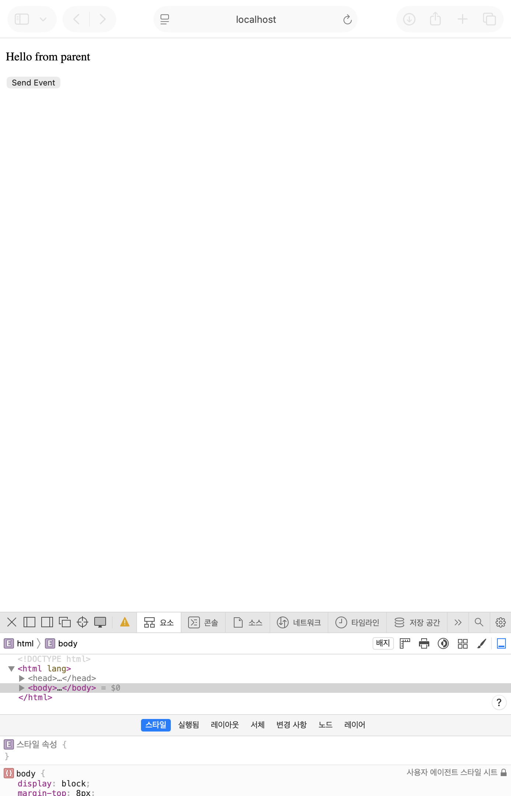
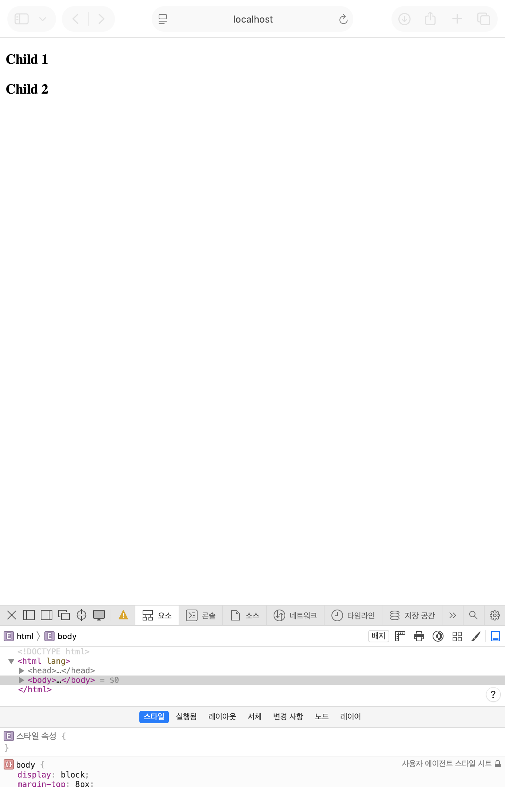
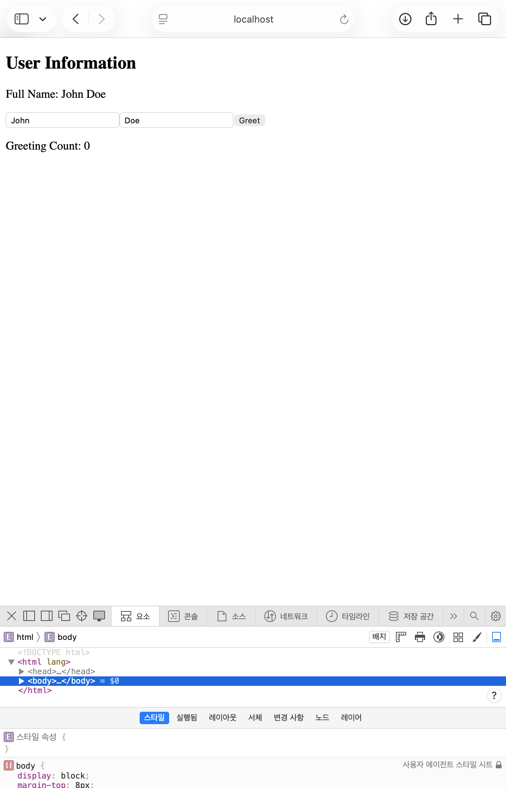

# vue-demo

## Project setup
```
npm install
```

### Compiles and hot-reloads for development
```
npm run serve
```

### Compiles and minifies for production
```
npm run build
```

### Lints and fixes files
```
npm run lint
```

### Customize configuration
See [Configuration Reference](https://cli.vuejs.org/config/).  


# 변경 요약

## E-01-instance.vue
script setup로 전환  
lang='ts'로 TypeScript 적용  
defineOptions()로 컴포넌트 이름 지정  
ref()로 반응형 상태 정의  
return 제거  


## E-02-reactive.vue 
computed()로 fullName 계산  
onMounted()안에서 SetTimeout()로 lastName 변경    


## E-03-binding.vue
v-model로 양방향 바인딩  


## E-04-directives.vue 


## Ex3_1ChildComponent.vue
defineProps()로 부모로부터 message 받음  
defineEmits()로 부모에게 custom-event 전달   


## ParentComponent.vue


## ChildComponent1.vue
inject()로 부모로부터 sharedMessage 받음  


## ParentComponent.vue
provide()로 자식들에게 sharedMessage 전달   


## E-07-Options-API.vue 
